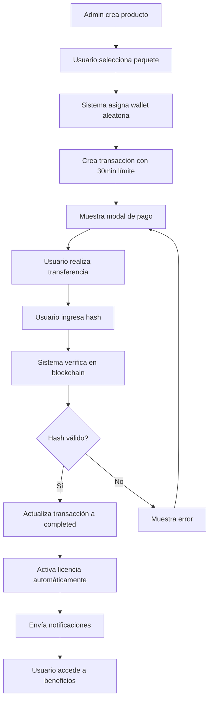

# Proceso de Compra Completo - GrowX5

## Visión General

Este documento describe el proceso completo de compra en GrowX5, desde la creación de productos en el panel de administración hasta la validación final por hash de transacción y activación automática de licencias.

---

## 1. GESTIÓN DE PRODUCTOS EN PANEL ADMINISTRATIVO

### 1.1 Creación de Productos

**Ubicación:** `frontend/src/components/admin/ProductManagement.jsx`

#### Campos de Producto:
- **Información Básica:**
  - Nombre del producto
  - Descripción
  - Precio (USDT)
  - Categoría (digital por defecto)
  - Estado (active/inactive/draft)

- **Configuración Avanzada:**
  - Características (features)
  - Beneficios específicos:
    - `firstWeekReturn`: "100%"
    - `dailyReturn`: "12.5%"
    - `totalReturn`: "100% semanal"
    - `referralCommission`: "10%"
    - `withdrawalTime`: "24 horas"
    - `priority`: "Media"
    - `membershipDays`: "180 días"
  
  - Límites de inversión:
    - `minInvestment`: Monto mínimo
    - `maxInvestment`: Monto máximo
    - `dailyLimit`: Límite diario

- **Metadatos:**
  - Imágenes del producto
  - URL de descarga
  - Versión
  - Tags
  - Requisitos
  - Stock disponible
  - Máximo de descargas

#### API de Gestión:
- **GET** `/api/admin/packages` - Obtener todos los paquetes
- **POST** `/api/admin/products` - Crear nuevo producto
- **PUT** `/api/admin/products/:id` - Actualizar producto
- **DELETE** `/api/admin/products/:id` - Eliminar producto

### 1.2 Paquetes Predefinidos

```javascript
PAQUETES_LICENCIA = {
  starter: { price: 100, name: 'Starter' },
  bronze: { price: 500, name: 'Bronze' },
  silver: { price: 1000, name: 'Silver' },
  gold: { price: 2500, name: 'Gold' },
  platinum: { price: 5000, name: 'Platinum' },
  diamond: { price: 10000, name: 'Diamond' },
  vip: { price: 25000, name: 'VIP' }
}
```

---

## 2. SISTEMA DE WALLETS Y ASIGNACIÓN

### 2.1 Gestión de Wallets en Panel Admin

**Ubicación:** `frontend/src/components/admin/WalletManager.jsx`

#### Configuración de Wallets:
- **Información Básica:**
  - Dirección de wallet
  - Red (BEP20, ERC20, TRC20, etc.)
  - Moneda (USDT)
  - Estado (active/inactive)
  - Etiqueta descriptiva

- **Configuración de Distribución:**
  - **Aleatorio** - Selección impredecible (por defecto)
  - **Secuencial** - Orden predefinido
  - **Balanceo de carga** - Distribución equitativa
  - **Basado en prioridad** - Según campo de prioridad

- **Límites y Restricciones:**
  - Máximo de usos concurrentes
  - Período de cooldown
  - Prioridad de uso
  - Monitoreo habilitado

### 2.2 Asignación Automática de Wallets

**Ubicación:** `backend/src/models/Wallet.model.js`

```javascript
// Método para obtener wallet disponible
walletSchema.statics.getAvailableWallet = async function(network = 'BEP20') {
  const wallets = await this.find({
    network: network,
    status: 'active'
  });
  
  // Selección aleatoria
  const randomIndex = Math.floor(Math.random() * wallets.length);
  const selectedWallet = wallets[randomIndex];
  
  // Actualizar estadísticas
  selectedWallet.lastUsed = new Date();
  selectedWallet.usageCount += 1;
  await selectedWallet.save();
  
  return selectedWallet;
};
```

### 2.3 Sistema de Roles y Permisos

#### Roles de Wallet:
- **wallet_viewer** - Solo visualización
- **wallet_manager** - Gestión básica (hasta 10 wallets/día)
- **wallet_admin** - Control total (hasta 50 wallets/día)

#### Restricciones por Rol:
```javascript
{
  max_wallets_per_day: 10,
  max_total_wallets: 100,
  allowed_networks: ['BEP20', 'ERC20', 'TRC20', 'POLYGON'],
  time_restrictions: {
    enabled: true,
    allowed_hours: { start: 8, end: 18 },
    allowed_days: [1, 2, 3, 4, 5] // Lunes a Viernes
  }
}
```

---

## 3. PROCESO DE COMPRA - TRES PASOS

### PASO 1: Selección de Producto y Generación de Pago

**Ubicación:** `backend/src/controllers/purchases.controller.js`

#### Flujo de Creación:
1. **Usuario selecciona paquete** en el frontend
2. **Validación de datos** (usuario, producto, monto)
3. **Creación de Purchase** en base de datos:
   ```javascript
   const purchase = new Purchase({
     userId: userId,
     productId: productId,
     amount: productPrice,
     status: 'pending',
     paymentMethod: 'crypto',
     metadata: {
       packageName: productName,
       packagePrice: productPrice
     }
   });
   ```

4. **Generación de referencia externa:**
   ```javascript
   const externalReference = `PKG_${Date.now()}_${userId.toString().slice(-6)}`;
   ```

5. **Asignación automática de wallet:**
   ```javascript
   const paymentWalletAddress = process.env.PAYMENT_WALLET_ADDRESS || 'TBD';
   // O asignación dinámica desde pool de wallets
   ```

6. **Creación de Transaction con expiración:**
   ```javascript
   const transaction = new Transaction({
     user: userId,
     type: 'package_purchase',
     amount: amount,
     currency: 'USDT',
     status: 'pending',
     externalReference: externalReference,
     payment: {
       method: 'crypto',
       address: paymentWalletAddress,
       network: 'BEP20',
       confirmations: 0
     },
     expiresAt: new Date(Date.now() + 30 * 60 * 1000) // 30 minutos
   });
   ```

### PASO 2: Modal de Pago con Temporizador

**Ubicación:** `frontend/src/components/payment/PaymentModal.jsx`

#### Características del Modal:
- **Temporizador de 30 minutos** para completar el pago
- **Información de pago:**
  - Dirección de wallet asignada
  - Monto exacto en USDT
  - Red de pago (BEP20)
  - QR code para facilitar transferencia

- **Instrucciones multiidioma:**
  ```javascript
  instructions: {
    en: `Send exactly ${plan.price} USDT to the wallet address above using BEP20 network (Binance Smart Chain). You have 30 minutes to complete this payment.`,
    es: `Envía exactamente ${plan.price} USDT a la dirección de billetera anterior usando la red BEP20 (Binance Smart Chain). Tienes 30 minutos para completar este pago.`
  }
  ```

- **Estados del modal:**
  - `pending` - Esperando pago
  - `checking` - Verificando transacción
  - `confirmed` - Pago confirmado
  - `failed` - Pago fallido
  - `expired` - Tiempo agotado

#### Funcionalidades:
- **Contador regresivo** visual de 30 minutos
- **Actualización automática** del estado cada 30 segundos
- **Opción de verificación manual** por hash
- **Notificaciones en tiempo real**

### PASO 3: Validación por Hash y Activación

**Ubicación:** `frontend/src/components/payment/PaymentModal.jsx` y `backend/src/controllers/payment.controller.js`

#### Proceso de Validación:

1. **Usuario ingresa hash de transacción:**
   ```javascript
   const handleHashSubmit = async (e) => {
     e.preventDefault();
     if (!userTxHash.trim() || !transactionId) return;
     
     setIsVerifying(true);
     await verifyBEP20Transaction(userTxHash.trim());
   };
   ```

2. **Verificación en blockchain:**
   ```javascript
   const response = await api.post('/payments/verify-bsc-transaction', {
     transactionHash: txHash.trim(),
     walletAddress: paymentData.walletAddress,
     expectedAmount: selectedPackage.price,
     packageId: selectedPackage.id,
     transactionId
   });
   ```

3. **Validación en backend:**
   - Verificar hash en BSC/BEP20
   - Confirmar dirección de destino
   - Validar monto exacto
   - Verificar que no sea transacción duplicada

4. **Activación automática:**
   ```javascript
   if (result.status === 'confirmed') {
     setPaymentStatus('confirmed');
     setTransactionHash(txHash);
     
     // Crear notificación de pago confirmado
     await createPurchaseNotification(transactionData);
     
     // Activar licencia automáticamente
     await LicenseActivationService.activateLicenseAfterPayment(
       transaction.user,
       transaction.metadata.packageType,
       transaction.amount
     );
   }
   ```

---

## 4. WEBHOOK DE CONFIRMACIÓN AUTOMÁTICA

**Ubicación:** `backend/src/controllers/payment.controller.js`

### Proceso del Webhook:

```javascript
exports.packagePaymentWebhook = async (req, res) => {
  try {
    // 1. Verificar firma del webhook
    const signature = req.headers['x-webhook-signature'];
    const payload = JSON.stringify(req.body);
    const expectedSignature = crypto
      .createHmac('sha256', process.env.WEBHOOK_SECRET)
      .update(payload)
      .digest('hex');

    if (signature !== expectedSignature) {
      return res.status(401).json({ success: false });
    }

    // 2. Buscar transacción por referencia externa
    const transaction = await Transaction.findOne({
      externalReference: req.body.external_reference
    });

    // 3. Validar monto y moneda
    if (req.body.amount !== transaction.amount || 
        req.body.currency !== 'USDT') {
      throw new Error('Monto o moneda no coinciden');
    }

    // 4. Actualizar estado de transacción
    transaction.status = 'completed';
    transaction.payment.confirmations = 12;
    await transaction.save();

    // 5. Activar licencia inmediatamente
    const result = await LicenseActivationService.activateLicenseAfterPayment(
      transaction.user,
      transaction.metadata.packageType,
      transaction.amount
    );

    res.json({ success: true });
  } catch (error) {
    logger.error('Webhook error:', error);
    res.status(500).json({ success: false });
  }
};
```

---

## 5. SISTEMA DE NOTIFICACIONES

### Notificaciones Automáticas:

#### Al Generar Pago:
- 📋 "Pago Pendiente" con detalles de transacción
- ⏰ Información de tiempo límite (30 minutos)
- 💳 Dirección de wallet y monto exacto

#### Al Confirmar Pago:
- ✅ "Pago Confirmado" con hash de transacción
- 📊 Enlace al historial de compras
- 🎉 Confirmación del monto procesado

#### Al Activar Licencia:
- 🎯 "¡Licencia Activada!" con detalles del paquete
- 📅 Información sobre el primer beneficio (próximas 24 horas)
- 🔗 Enlace directo al dashboard

### APIs de Notificaciones:
- `POST /api/user/notifications` - Crear notificaciones
- `GET /api/user/notifications` - Obtener notificaciones
- `PATCH /api/user/notifications/:id/read` - Marcar como leída

---

## 6. VALIDACIONES Y SEGURIDAD

### Validaciones Críticas:

1. **Validación de Hash:**
   ```javascript
   static generateVerificationHash(userId, amount, day) {
     const data = `${userId}-${amount}-${day}-${Date.now()}`;
     return crypto.createHash('sha256').update(data).digest('hex');
   }
   ```

2. **Tolerancia de Monto:**
   - Permite variaciones mínimas por fees de red
   - Registra sobrepagos para reembolso

3. **Prevención de Duplicados:**
   - Verificación de hash único por transacción
   - Control de referencias externas

4. **Expiración de Transacciones:**
   - Límite de 30 minutos para completar pago
   - Limpieza automática de transacciones expiradas

### Medidas de Seguridad:

- **Firmas de Webhook** con HMAC-SHA256
- **Validación de direcciones** por red
- **Límites de creación** de wallets por rol
- **Auditoría completa** de todas las operaciones
- **Encriptación** de datos sensibles

---

## 7. ESTRUCTURA DE DATOS

### Modelo Purchase:
```javascript
{
  userId: ObjectId,
  productId: ObjectId,
  amount: Number,
  status: 'pending' | 'completed' | 'failed' | 'expired',
  paymentMethod: 'crypto' | 'wallet',
  txHash: String,
  network: 'BEP20' | 'ERC20' | 'TRC20',
  metadata: {
    packageName: String,
    packagePrice: Number,
    userEmail: String
  },
  createdAt: Date,
  updatedAt: Date
}
```

### Modelo Transaction:
```javascript
{
  user: ObjectId,
  type: 'package_purchase',
  amount: Number,
  currency: 'USDT',
  status: 'pending' | 'completed' | 'failed',
  externalReference: String,
  payment: {
    method: 'crypto',
    address: String,
    network: String,
    confirmations: Number
  },
  metadata: {
    purchaseId: ObjectId,
    packageType: String,
    productName: String
  },
  expiresAt: Date,
  createdAt: Date
}
```

### Modelo Wallet:
```javascript
{
  address: String,
  network: 'BEP20' | 'ERC20' | 'TRC20',
  currency: 'USDT',
  status: 'active' | 'inactive',
  distributionMethod: 'random' | 'sequential' | 'load_balanced',
  lastUsed: Date,
  usageCount: Number,
  balance: Number,
  isPaymentWallet: Boolean,
  addedBy: ObjectId,
  createdAt: Date
}
```

---

## 8. FLUJO COMPLETO RESUMIDO



---

## 9. ARCHIVOS CLAVE

### Frontend:
- `src/components/admin/ProductManagement.jsx` - Gestión de productos
- `src/components/admin/WalletManager.jsx` - Gestión de wallets
- `src/components/payment/PaymentModal.jsx` - Modal de pago
- `src/components/payment/PaymentCart.jsx` - Carrito de compras
- `src/pages/user/packages/PackagesSection.jsx` - Selección de paquetes

### Backend:
- `src/controllers/purchases.controller.js` - Lógica de compras
- `src/controllers/payment.controller.js` - Procesamiento de pagos
- `src/controllers/adminPackage.controller.js` - Gestión admin de paquetes
- `src/models/Purchase.model.js` - Modelo de compras
- `src/models/Transaction.model.js` - Modelo de transacciones
- `src/models/Wallet.model.js` - Modelo de wallets
- `src/services/LicenseActivationService.js` - Activación de licencias

### Configuración:
- `backend/scripts/seed-wallets.js` - Inicialización de wallets
- `backend/src/scripts/init-wallet-roles.js` - Configuración de roles
- `frontend/public/locales/*/purchaseSuccess.json` - Traducciones

---

## 10. MÉTRICAS Y MONITOREO

### Métricas Clave:
- Tiempo promedio de confirmación de pago
- Tasa de éxito de transacciones
- Distribución de uso de wallets
- Volumen de ventas por paquete
- Errores de validación de hash

### Logs Importantes:
- Creación de transacciones
- Asignación de wallets
- Verificaciones de hash
- Activaciones de licencias
- Errores de webhook

---

**Última actualización:** Enero 2025  
**Estado:** Producción - Completamente funcional  
**Versión:** 2.4.0